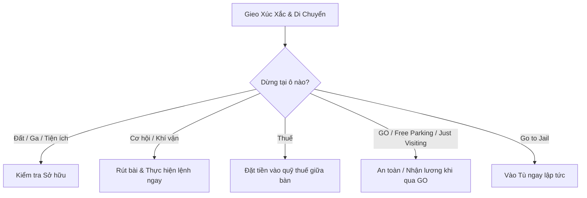

# TỔNG HỢP TOÀN BỘ LUẬT CHƠI CỜ TỶ PHÚ (MONOPOLY BOARD GAME)

Tài liệu này tổng hợp toàn bộ quy tắc chuẩn mực của trò chơi **Cờ Tỷ Phú (Monopoly)** theo chuẩn quốc tế (Hasbro Classic Monopoly), kèm theo các giải thích chi tiết, các tình huống đặc biệt và phân biệt rõ giữa **Luật chính thức** và **Luật gia đình (House Rules)** phổ biến.

---

## MỤC LỤC
1. [Giới thiệu & Mục tiêu trò chơi](#1-giới-thiệu--mục-tiêu-trò-chơi)
2. [Thành phần bộ cờ & Chuẩn bị ban đầu](#2-thành-phần-bộ-cờ--chuẩn-bị-ban-đầu)
3. [Quy tắc lượt đi cơ bản](#3-quy-tắc-lượt-đi-cơ-bản)
4. [Chi tiết các loại ô trên bàn cờ](#4-chi-tiết-các-loại-ô-trên-bàn-cờ)
5. [Quy tắc Mua, Đấu giá & Thu Tiền thuê](#5-quy-tắc-mua-đấu-giá--thu-tiền-thuê)
6. [Xây dựng Nhà & Khách sạn](#6-xây-dựng-nhà--khách-sạn)
7. [Nhà Tù & Cách Thoát Tù](#7-nhà-tù--cách-thoát-tù)
8. [Giao dịch & Trao đổi tài sản (Trading)](#8-giao-dịch--trao-đổi-tài-sản-trading)
9. [Thế chấp & Chuộc tài sản (Mortgage)](#9-thế-chấp--chuộc-tài-sản-mortgage)
10. [Phá sản & Kết thúc trò chơi](#10-phá-sản--kết-thúc-trò-chơi)
11. [Luật chơi nhanh / Trận đấu giới hạn thời gian](#11-luật-chơi-nhanh--trận-đấu-giới-hạn-thời-gian)
12. [Các "Luật Gia Đình" phổ biến (House Rules - Cần lưu ý)](#12-các-luật-gia-đình-phổ-biến-house-rules---cần-lưu-ý)

---

## 1. GIỚI THIỆU & MỤC TIÊU TRÒ CHƠI

- **Số lượng người chơi:** 2 – 8 người.
- **Mục tiêu chính:** Trở thành **người chơi duy nhất không bị phá sản** bằng cách mua, cho thuê, kinh doanh và phát triển các bất động sản trên bàn cờ để tích lũy tài sản và khiến đối thủ cạn kiệt tài chính.

---

## 2. THÀNH PHẦN BỘ CỜ & CHUẨN BỊ BAN ĐẦU

### 2.1. Các thành phần trong bộ cờ
- **Bàn cờ 40 ô:** Bao gồm 28 ô tài sản (22 khu đất màu, 4 Nhà ga/Bến xe, 2 Công ty Tiện ích), 3 ô Cơ hội (Chance), 3 ô Khí vận (Community Chest), 2 ô Thuế, và 4 ô góc đặc biệt (`GO`, `Jail / Just Visiting`, `Free Parking`, `Go to Jail`).
- **2 viên xúc xắc 6 mặt** & **Quân cờ đại diện (Tokens)** cho mỗi người chơi.
- **Thẻ Sở hữu (Title Deeds):** 28 thẻ tương ứng với 28 tài sản.
- **Thẻ Cơ hội (Chance) & Thẻ Khí vận (Community Chest):** 16 thẻ mỗi loại.
- **32 căn Nhà (Màu xanh lá)** & **12 Khách sạn (Màu đỏ)**.
- **Tiền cờ tỷ phú (Monopoly Money).**

### 2.2. Chuẩn bị trò chơi (Setup)
1. Đặt bàn cờ ở giữa bàn. Xáo trộn riêng hai chồng bài **Cơ hội (Chance)** và **Khí vận (Community Chest)** rồi đặt úp vào ô quy định trên bàn cờ.
2. Mỗi người chơi chọn 1 quân cờ đại diện và đặt tại ô **BẮT ĐẦU (GO)**.
3. **Chỉ định Ngân hàng (Banker):** Chọn một người chơi (hoặc một người riêng biệt) làm Ngân hàng để quản lý:
   - Tiền của Ngân hàng.
   - Thẻ Sở hữu đất chưa có chủ.
   - Nhà và Khách sạn.
   - Tổ chức đấu giá, thu thuế, phạt, và cho vay thế chấp.
   > [!NOTE]
   > Ngân hàng **không bao giờ phá sản**. Nếu Ngân hàng hết tiền giấy, Banker có thể dùng giấy ghi nhớ để theo dõi số tiền phát hành thêm.

4. **Phát tiền vốn ban đầu:**
   Mỗi người chơi nhận tổng cộng **$1.500** (hoặc tương đương theo tỷ lệ phiên bản, ví dụ 15.000k / 150.000 VNĐ). Phân bổ chuẩn quốc tế gồm:
   | Mệnh giá | Số lượng | Tổng |
   | :--- | :---: | :---: |
   | **$500** | 2 tờ | $1.000 |
   | **$100** | 4 tờ | $400 |
   | **$50** | 1 tờ | $50 |
   | **$20** | 1 tờ | $20 |
   | **$10** | 2 tờ | $20 |
   | **$5** | 1 tờ | $5 |
   | **$1** | 5 tờ | $5 |
   | **TỔNG** | | **$1.500** |

---

## 3. QUY TẮC LƯỢT ĐI CƠ BẢN

Mỗi người gieo 2 xúc xắc để quyết định người đi trước (ai có tổng điểm cao nhất đi đầu tiên). Sau đó lượt chơi diễn ra theo chiều kim đồng hồ.

Trong lượt của mình, người chơi thực hiện các bước sau:
1. **Gieo 2 viên xúc xắc** và di chuyển quân cờ theo chiều kim đồng hồ đúng bằng tổng số chấm trên 2 viên xúc xắc.
2. Thực hiện hành động tương ứng tại ô dừng chân (mua đất, trả tiền thuê, rút bài, đóng thuế...).
3. **Quy tắc Xúc xắc đôi (Doubles):**
   - Nếu đổ ra 2 xúc xắc có số chấm bằng nhau (ví dụ: `4 - 4`), bạn thực hiện xong lượt đi hiện tại, sau đó **được gieo xúc xắc đi thêm 1 lượt nữa**.
   - > [!WARNING]
     > **Phạt Vào Tù vì Đổ Đôi 3 lần:** Nếu bạn gieo ra xúc xắc đôi **3 lần liên tiếp trong cùng 1 lượt**, ngay sau lần đổ đôi thứ 3, quân cờ của bạn **lập tức bị vào Tù (Go to Jail)** mà không di chuyển theo số xúc xắc lần thứ 3 đó. Lượt của bạn lập tức kết thúc.

---

## 4. CHI TIẾT CÁC LOẠI Ô TRÊN BÀN CỜ

### 4.1. Ô Bắt Đầu (GO)
- Mỗi khi quân cờ của bạn **đi ngang qua** hoặc **dừng lại** trên ô GO theo chiều kim đồng hồ, Ngân hàng trả cho bạn tiền lương **$200**.
- Tiền lương luôn là **$200**; không dùng các mốc lẻ hoặc mức thưởng khác.
- Phiên bản này không sử dụng mệnh giá **$1** và **$5**. Tiền thuê, tiện ích, thế chấp, đấu giá và các giao dịch khác được làm tròn về bội số gần nhất của **$10**; khoản dương tối thiểu là **$10**.

### 4.2. Ô Cơ hội (Chance) & Khí vận (Community Chest)
- Rút lá bài trên cùng của chồng bài tương ứng.
- Đọc to và **thực hiện yêu cầu ngay lập tức** (nhận tiền, trả tiền, di chuyển đến ô chỉ định, vào tù...).
- Sau khi dùng, đặt lá bài xuống **dưới cùng** của chồng bài.
- *Ngoại lệ:* Thẻ **"Thoát Tù Miễn Phí" (Get Out of Jail Free)** được giữ lại cho đến khi sử dụng hoặc bán/trao đổi cho người khác.
- **Cơ Hội - chia quỹ thuế:** các thẻ thưởng quỹ cho phép nhận **10%, 50% hoặc 100%** số tiền đang có giữa bàn. Khoản 10% và 50% được làm tròn xuống theo bội số **$10**.
- **Khí Vận - hoàn thuế:** các thẻ hoàn thuế cho phép nhận lần lượt **20%, 40%, 60% hoặc 100%** số tiền đang có trong quỹ. Khoản nhận được làm tròn xuống theo bội số **$10**.
- **Thẻ thuế bổ sung:** ngoài hai ô Thuế mặc định, cả hai bộ bài có thể yêu cầu nộp **10% tiền mặt**, nộp cố định **$100/$200**, hoặc sung công số tiền bằng một tỷ lệ của quỹ thuế hiện có.
- **Truy thu tài sản:** nộp **10% tổng tài sản**, gồm tiền mặt, giá niêm yết của bất động sản đang sở hữu và giá trị nhà/khách sạn đã xây.
- Nếu tiền mặt không đủ để trả một thẻ thuế hoặc ô Thuế, phần thiếu được ghi thành **nợ thuế**. Mỗi lần người mắc nợ đi qua Bắt Đầu, khoản nợ tăng **$20 nếu nợ không quá $400**, hoặc **$50 nếu nợ trên $400**.
- Nợ được kéo dài tối đa **3 vòng**. Người chơi có thể thanh toán sớm; ở lần qua Bắt Đầu thứ ba, hệ thống dùng tiền mặt trước rồi tự động bán bất động sản và công trình vừa đủ để thanh toán.
- Giá thanh lý gồm giá niêm yết của đất cộng giá trị xây dựng; tài sản đã thế chấp chỉ còn 50% giá đất. Hệ thống ưu tiên tài sản nhỏ nhất đủ trả nợ, hoặc tài sản có giá trị lớn nhất nếu phải bán nhiều tài sản.
- Chỉ khi đã dùng hết tiền mặt và thanh lý toàn bộ bất động sản mà vẫn còn nợ, người chơi mới bị tuyên bố **phá sản**.

### 4.3. Ô Thuế (Income Tax / Luxury Tax)
- **Thuế Thu nhập (Income Tax):** Trả cố định **$200**.
- **Thuế Đặc biệt (Luxury Tax / Super Tax):** Trả cố định **$100**.
- Toàn bộ tiền thuế được đặt vào **quỹ thuế giữa bàn cờ**, không chuyển về Ngân hàng. Số dư quỹ được giữ lại cho đến khi có thẻ Cơ Hội hoặc Khí Vận chi trả.

### 4.4. Ô Thăm Tù / Chỉ Đi Ngang Qua (Jail / Just Visiting)
- Nếu bạn đến ô này bằng các bước di chuyển thông thường từ xúc xắc, bạn đặt quân vào khu vực **"Thăm Tù"**.
- Nếu đang có người chơi bị giam, người đến thăm phải tặng **$100 cho mỗi người đang trong Tù**. Không được trả vượt quá số tiền mặt hiện có.
- Nếu không có ai đang bị giam, ô Thăm Tù không phát sinh giao dịch.

### 4.5. Ô Bãi Đậu Xe Miễn Phí (Free Parking)
- Theo luật chính thức, đây chỉ là **ô nghỉ ngơi an toàn**. Bạn không mất tiền, không nhận được tiền thưởng và không bị hành động gì.

### 4.6. Ô Vào Tù (Go to Jail)
- Khi dừng tại ô này, bạn phải **di chuyển quân cờ thẳng vào Tù ngay lập tức**.
- Bạn **không được** đi ngang qua ô GO và **không nhận $200**. Lượt đi kết thúc ngay.

---

## 5. QUY TẮC MUA, ĐẤU GIÁ & THU TIỀN THUÊ

### 5.1. Khi dừng trên Bất động sản chưa có chủ
Khi dừng trên Đất, Nhà ga hoặc Công ty Tiện ích chưa ai sở hữu, bạn có 2 lựa chọn:
1. **Mua trực tiếp:** Trả cho Ngân hàng đúng giá tiền niêm yết trên bàn cờ. Nhận Thẻ Sở hữu (Title Deed) tương ứng và đặt ngửa trước mặt.
2. **Từ chối mua (Bắt buộc Đấu giá - Auction):**
   - Nếu bạn từ chối mua ở giá niêm yết, Ngân hàng **bắt buộc phải mở phiên Đấu giá công khai** ngay lập tức cho tài sản đó.
   - **Tất cả người chơi** (bao gồm cả người vừa từ chối mua ở giá gốc) đều có quyền tham gia trả giá.
   - Giá khởi điểm có thể từ **$10** (hoặc thậm chí $1).
   - Người ra giá cao nhất trả tiền cho Ngân hàng và nhận Thẻ Sở hữu.

### 5.2. Khi dừng trên Bất động sản đã có chủ (Thu tiền thuê)
Nếu bạn dừng trên tài sản thuộc sở hữu của người khác (và chưa bị thế chấp), bạn phải trả **Tiền thuê (Rent)** cho chủ sở hữu theo quy định:

#### A. Khu đất màu (Color Properties)
- **Đất trống (Chưa xây nhà):** Trả mức giá dòng đầu tiên trên thẻ sở hữu.
  > [!IMPORTANT]
  > **Quyền lợi Monopoly (Độc quyền bộ màu):** Nếu chủ sở hữu nắm giữ **trọn bộ tất cả các mảnh đất cùng màu** (chưa xây nhà), tiền thuê đất trống của các ô trong bộ màu đó **TĂNG GẤP ĐÔI (x2)**.
- **Đất đã có Nhà / Khách sạn:** Trả tiền thuê cao hơn tương ứng với số Nhà hoặc Khách sạn ghi trên thẻ.

#### B. Nhà ga / Bến xe (Railroads - 4 ô)
Tiền thuê phụ thuộc vào **tổng số Nhà ga** mà chủ sở hữu đó đang nắm giữ:
- Sở hữu 1 Nhà ga: **$25**
- Sở hữu 2 Nhà ga: **$50**
- Sở hữu 3 Nhà ga: **$100**
- Sở hữu 4 Nhà ga: **$200**

#### C. Công ty Tiện ích (Utilities - Điện & Nước - 2 ô)
Tiền thuê được tính dựa vào **tổng số chấm xúc xắc** bạn vừa đổ ra để đi vào ô đó:
- Nếu chủ sở hữu có **1 Công ty**: Tiền thuê = **Số chấm xúc xắc x 4**
- Nếu chủ sở hữu có **cả 2 Công ty**: Tiền thuê = **Số chấm xúc xắc x 10**

> [!NOTE]
> **Quy tắc đòi tiền thuê:** Chủ sở hữu **phải lên tiếng đòi tiền thuê** trước khi người chơi tiếp theo gieo xúc xắc. Nếu người tiếp theo đã gieo xúc xắc mà chủ sở hữu quên đòi, chủ sở hữu **mất quyền thu tiền thuê** của lượt đó.

---

## 6. XÂY DỰNG NHÀ & KHÁCH SẠN

### 6.1. Điều kiện xây dựng
- Bạn chỉ được xây Nhà/Khách sạn trên một nhóm đất khi bạn đã **sở hữu trọn bộ màu (Monopoly)** của nhóm đất đó.
- Không có bất kỳ mảnh đất nào trong nhóm màu đó đang bị **Thế chấp (Mortgaged)**.
- Bạn có thể xây nhà vào **bất kỳ lúc nào** trong lượt của mình hoặc giữa lượt của người khác, không cần đợi đến khi đi vào ô đất đó.

### 6.2. Quy tắc Xây Đồng Đều (Even Build Rule)
- Bạn phải xây dựng các căn nhà **đồng đều** trên toàn bộ các mảnh đất cùng màu:
  - Bạn không được xây ngôi nhà thứ 2 trên bất kỳ ô nào cho đến khi tất cả các ô trong nhóm màu đều đã có 1 căn nhà.
  - Tương tự, khi bán nhà lại cho Ngân hàng, bạn cũng phải tháo dỡ đồng đều.

### 6.3. Khách Sạn (Hotel)
- Khi một mảnh đất đã có **4 căn nhà**, bạn có thể trả chi phí nâng cấp Khách sạn (giá niêm yết trên thẻ), trả lại 4 căn nhà cho Ngân hàng và đặt 1 Khách sạn lên ô đất.
- Mỗi ô đất chỉ được đặt **tối đa 1 Khách sạn**.

### 6.4. Khan hiếm Nhà & Khách sạn (Housing Shortage)
- Ngân hàng chỉ có tối đa **32 căn Nhà** và **12 Khách sạn**.
- Nếu Ngân hàng hết Nhà, người chơi muốn xây phải đợi người khác bán Nhà lại cho Ngân hàng hoặc nâng cấp lên Khách sạn.
- Nếu nhiều người chơi cùng muốn mua số lượng Nhà còn lại của Ngân hàng, Ngân hàng sẽ tổ chức **Đấu giá** số Nhà đó cho người trả cao nhất.

---

## 7. NHÀ TÙ & CÁCH THOÁT TÙ

### 7.1. 3 Nguyên nhân bị Vào Tù
1. Dừng chân tại ô **"Vào Tù" (Go to Jail)**.
2. Rút phải thẻ Cơ hội / Khí vận có lệnh **"Đi tù ngay lập tức" (Go directly to Jail)**.
3. Gieo xúc xắc ra **Đôi (Doubles) 3 lần liên tiếp** trong cùng một lượt.

### 7.2. Quyền lợi khi ở trong Tù
> [!TIP]
> **Quan niệm sai lầm phổ biến:** Ngồi trong tù KHÔNG làm bạn mất quyền kinh doanh. Khi ở trong Tù, bạn **VẪN ĐƯỢC**:
> - Thu tiền thuê đất từ người chơi khác.
> - Mua bán, trao đổi bất động sản với người chơi khác.
> - Xây dựng Nhà / Khách sạn hoặc Thế chấp / Chuộc tài sản.

### 7.3. 3 Cách để Thoát Tù

| Cách thoát tù | Chi tiết thực hiện |
| :--- | :--- |
| **1. Trả $50 tiền phạt** | Trả **$50** cho Ngân hàng vào **đầu lượt đi** của bạn (trước khi gieo xúc xắc). Sau đó gieo xúc xắc và di chuyển bình thường theo số chấm. |
| **2. Dùng thẻ "Thoát Tù Miễn Phí"** | Sử dụng lá bài **Get Out of Jail Free** (tự rút được hoặc mua lại từ người khác). Trả lá bài về chồng bài cũ, sau đó gieo xúc xắc di chuyển. |
| **3. Gieo ra Xúc xắc Đôi** | Trong lượt của mình, bạn được quyền thử gieo xúc xắc. Nếu ra **Đôi**, bạn lập tức thoát tù và di chuyển đúng bằng số chấm vừa gieo (lưu ý: *không được gieo thêm lần 2* dù đổ ra đôi). |

> [!IMPORTANT]
> **Giới hạn 3 lượt trong Tù:** Nếu sau **3 lượt** thử gieo xúc xắc mà bạn vẫn không gieo được Đôi, ở lượt thứ 3 bạn **bắt buộc phải trả $50** cho Ngân hàng, sau đó thoát tù và di chuyển theo đúng số chấm xúc xắc vừa gieo ở lượt thứ 3 đó.

---

## 8. GIAO DỊCH & TRAO ĐỔI TÀI SẢN (TRADING)

- Người chơi có thể tự do thỏa thuận mua bán, trao đổi tài sản với nhau vào **bất kỳ lúc nào**.
- **Tài sản có thể giao dịch:** Đất trống (chưa có công trình), Nhà ga, Công ty Tiện ích, Thẻ Thoát tù miễn phí, Tiền mặt.
- **Quy tắc quan trọng đối với đất có công trình:**
  - Bạn **KHÔNG THỂ** bán hoặc trao đổi mảnh đất đang có Nhà/Khách sạn.
  - Trước khi giao dịch bất kỳ mảnh đất nào thuộc nhóm màu đang có công trình, bạn phải **bán lại toàn bộ Nhà/Khách sạn** trên nhóm màu đó cho Ngân hàng với **nửa giá gốc (50%)**.

---

## 9. THẾ CHẤP & CHUỘC TÀI SẢN (MORTGAGE)

### 9.1. Thế chấp tài sản cho Ngân hàng
- Khi cần tiền mặt, bạn có thể lật úp thẻ tài sản để thế chấp cho Ngân hàng và nhận số tiền ghi ở mặt sau thẻ (thường bằng **50% giá mua ban đầu**).
- Chỉ được thế chấp đất trống (phải bán hết Nhà/Khách sạn của nhóm màu đó cho Ngân hàng trước).
- **Tài sản đang thế chấp KHÔNG thu được tiền thuê.** Tuy nhiên, các mảnh đất khác cùng nhóm màu (chưa thế chấp) vẫn thu được tiền thuê gấp đôi đối với đất trống.

### 9.2. Chuộc tài sản (Unmortgage)
- Để lật ngửa thẻ lại và khôi phục quyền thu tiền thuê, bạn phải trả cho Ngân hàng:
  $$\text{Tiền chuộc} = \text{Giá trị thế chấp} + \mathbf{10\% \text{ tiền lãi}}$$

### 9.3. Chuyển nhượng tài sản đang thế chấp
- Nếu bạn mua/nhận trao đổi một tài sản **đang bị thế chấp** từ người chơi khác:
  1. Bạn phải lập tức nộp **10% tiền lãi thế chấp** cho Ngân hàng ngay khi nhận thẻ.
  2. Bạn có quyền chọn **chuộc ngay lập tức** bằng cách trả thêm tiền gốc thế chấp.
  3. Nếu bạn giữ nguyên trạng thái thế chấp để chuộc sau, sau này khi chuộc bạn sẽ phải trả tiền gốc + **thêm 10% tiền lãi một lần nữa**.

---

## 10. PHÁ SẢN & KẾT THÚC TRÒ CHƠI

Bạn bị coi là **Phá sản (Bankrupt)** khi số tiền bạn nợ (Ngân hàng hoặc người chơi khác) vượt quá tổng tài sản có thể huy động bằng tiền mặt, bán nhà (50% giá) và thế chấp đất.

### 10.1. Phá sản do nợ NGÂN HÀNG (Thuế, Phạt...)
- Bạn giao nộp toàn bộ tài sản cho Ngân hàng và bị loại khỏi cuộc chơi.
- Ngân hàng lập tức đem **Đấu giá công khai** từng bất động sản của bạn cho những người chơi còn lại.

### 10.2. Phá sản do nợ NGƯỜI CHƠI KHÁC
- Bạn chuyển giao **toàn bộ tài sản còn lại** (tiền mặt, thẻ Thoát tù miễn phí, bất động sản) cho chủ nợ và bị loại.
- Đối với các tài sản đang bị thế chấp chuyển cho chủ nợ: Chủ nợ lập tức phải đóng **10% phí chuyển nhượng thế chấp** cho Ngân hàng.

### 10.3. Người chiến thắng
- Trò chơi kết thúc khi chỉ còn **1 người chơi duy nhất** chưa bị phá sản trên bàn cờ. Đó là **Tỷ Phú chiến thắng**.

---

## 11. LUẬT CHƠI NHANH / TRẬN ĐẤU GIỚI HẠN THỜI GIAN

Để tránh ván cờ kéo dài quá lâu (4–6 tiếng), bạn có thể áp dụng **Luật Giới hạn Thời gian (Short Game / Timed Game)** chính thức:
1. Thống nhất thời gian chơi trước khi bắt đầu (ví dụ: 60 hoặc 90 phút).
2. Khi đồng hồ hết giờ, ván chơi kết thúc ngay lập tức.
3. Tất cả người chơi tính **Tổng Giá Trị Tài Sản (Net Worth)** bao gồm:
   - Tiền mặt đang có.
   - Giá trị gốc của các bất động sản KHÔNG bị thế chấp (100% giá mua).
   - Giá trị thế chấp của các bất động sản ĐANG thế chấp (50% giá mua).
   - Giá trị mua gốc của toàn bộ Nhà và Khách sạn đang sở hữu.
4. Người có **Tổng tài sản cao nhất** là người chiến thắng.

---

## 12. CÁC "LUẬT GIA ĐÌNH" PHỔ BIẾN (HOUSE RULES - CẦN LƯÝ)

> [!CAUTION]
> Dưới đây là các luật mà nhiều người chơi thường tự đặt ra. **Chúng KHÔNG PHẢI là luật chính thức của Monopoly** và thường khiến ván cờ kéo dài cực kỳ lâu. Bạn nên thống nhất trước ván chơi có áp dụng hay không:

1. **"Tiền thưởng Bãi đậu xe miễn phí" (Free Parking Jackpot - KHÔNG ÁP DỤNG):**
   - Tiền thuế vẫn được gom giữa bàn theo luật của phiên bản này, nhưng ô `Free Parking` **không nhận quỹ**. Quỹ chỉ được chi bởi thẻ Cơ Hội và Khí Vận theo Điều 4.2.
2. **"Không được thu tiền thuê khi ở trong Tù" (KHÔNG CHÍNH THỨC):**
   - *Luật chuẩn:* Người trong tù VẪN thu tiền thuê bình thường.
3. **"Phải đi đủ 1 vòng bàn cờ mới được bắt đầu mua đất" (KHÔNG CHÍNH THỨC):**
   - *Luật chuẩn:* Bạn có thể mua đất ngay từ ô đầu tiên bạn dừng lại sau lần gieo xúc xắc đầu tiên.
4. **"Cho vay trực tiếp giữa người chơi" (KHÔNG CHÍNH THỨC):**
   - *Luật chuẩn:* Người chơi KHÔNG được phép cho người khác vay tiền. Chỉ có Ngân hàng mới được cấp vốn thông qua hình thức Thế chấp tài sản (Mortgage).
