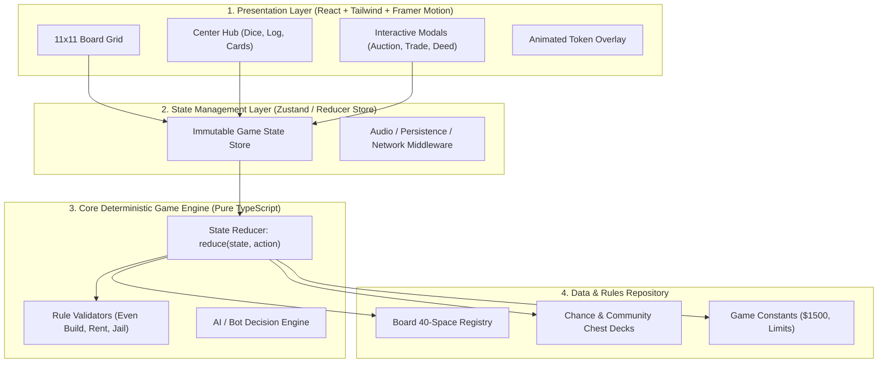
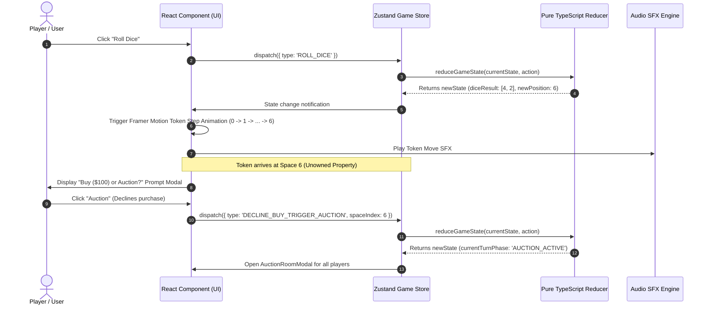

# MONOPOLY WEB APPLICATION: ARCHITECTURE, TECH STACK & DEVELOPMENT WORKFLOW

This document specifies the **End-to-End System Architecture, Technology Stack, Language Standards, and Development Workflow (Flowwork)** for the Monopoly Web Application.

---

## TABLE OF CONTENTS
1. [System Architecture & Layering](#1-system-architecture--layering)
2. [Technology Stack & Language Standards](#2-technology-stack--language-standards)
3. [Component Hierarchy & Directory Structure](#3-component-hierarchy--directory-structure)
4. [Data Flow & Event Lifecycle (Flowwork)](#4-data-flow--event-lifecycle-flowwork)
5. [Phased Development Roadmap](#5-phased-development-roadmap)

---

## 1. SYSTEM ARCHITECTURE & LAYERING

The Monopoly Web Application follows a **4-Tier Clean Architecture** designed for strict determinism, high performance, visual excellence, and future multiplayer expansion.



### Key Architectural Principles:
1. **Framework-Agnostic Core Engine:** All Monopoly game logic resides in pure TypeScript functions (`reduceGameState(state, action): GameState`). It has zero dependency on React or browser APIs, allowing 100% unit test coverage.
2. **Single Source of Truth:** All 40 board spaces, property prices, rent tables, and cards are statically typed and immutable.
3. **Deterministic Action Dispatch:** Every game event (Roll Dice, Buy Property, Bid Auction, Build House, End Turn) is modeled as a strongly typed `GameAction`.

### Standalone vs. Backend Deployment Modes:
- **Mode A: 100% Client-Side / Standalone Web App (Default):**
  - **No Backend Server Required.** The entire application (UI + Pure TypeScript Game Engine + AI Bots) runs 100% inside the user's browser.
  - Supports local **Pass-and-Play (2-8 players on 1 screen)** and **Player vs. AI Bots**.
  - Game progress is saved directly to `localStorage`. Can be deployed to static hosting (GitHub Pages, Vercel, Netlify) with zero backend cost.
- **Mode B: Optional Online Multiplayer Backend (Expansion):**
  - Only required if enabling real-time online rooms across different devices.
  - Uses a lightweight Node.js + WebSocket/Socket.io server running the exact same pure TypeScript `reduceGameState` engine for server-authoritative anti-cheat validation.

---

## 2. TECHNOLOGY STACK & LANGUAGE STANDARDS

| Category | Technology | Rationale & Version |
| :--- | :--- | :--- |
| **Language** | **TypeScript 5.x** | Strict Mode enabled. Guarantees type safety across complex property states, action payloads, and board index lookups. |
| **Frontend Framework** | **React 18+ (Vite)** | Blazing-fast hot module replacement (HMR), component modularity, and optimized production bundling. |
| **Styling & Design System** | **Tailwind CSS + Custom CSS Grid** | Highly responsive `11x11` CSS Grid layout, vibrant glassmorphism UI modals, dark mode aesthetic, and custom design tokens. |
| **Animation Engine** | **Framer Motion** | Smooth step-by-step token pathfinding around perimeter spaces, realistic 3D dice physics animations, and fluid modal transitions. |
| **State Management** | **Zustand** (or Redux Toolkit) | Lightweight, hook-based immutable state container with middleware for `localStorage` auto-saving. |
| **Audio & SFX** | **Howler.js / Web Audio API** | Spatial audio triggers for dice clatter, cash register, property purchases, and jail sirens. |
| **Testing Suite** | **Vitest** | Fast unit testing for deterministic engine rules (rent doubling, auction logic, bankruptcy liquidation). |

---

## 3. COMPONENT HIERARCHY & DIRECTORY STRUCTURE

```
src/
├── core/                       # LAYER 3 & 4: PURE GAME ENGINE (No React imports)
│   ├── constants/
│   │   ├── gameConstants.ts    # Board size (40), starting cash ($1500), limits
│   │   └── boardData.ts        # 40-space registry with colors, prices, rents
│   ├── types/
│   │   ├── player.ts           # Player interface
│   │   ├── board.ts            # BoardSpace, PropertyColorGroup discriminated unions
│   │   ├── actions.ts          # GameAction union types
│   │   └── state.ts            # GameState interface
│   ├── engine/
│   │   ├── reducer.ts          # Root deterministic state reducer
│   │   ├── rentCalculator.ts   # Monopoly bonus, utilities, railroad rent logic
│   │   ├── jailLogic.ts        # 3-turn jail rules, bail, doubles check
│   │   └── aiBot.ts            # Heuristic decision making for AI players
│   └── __tests__/              # Vitest rule verification tests
│
├── store/                      # LAYER 2: STATE STORE & MIDDLEWARE
│   ├── useGameStore.ts         # Zustand store binding Engine to React
│   └── persistence.ts          # LocalStorage save/resume serialization
│
├── components/                 # LAYER 1: PRESENTATION (UI/UX)
│   ├── board/
│   │   ├── MonopolyBoard.tsx   # 11x11 Grid Container
│   │   ├── CornerSpace.tsx     # GO, Jail, Free Parking, Go to Jail (2x2 ratio)
│   │   ├── StreetSpace.tsx     # Colored property spaces with House/Hotel badges
│   │   ├── SpecialSpace.tsx    # Railroads, Utilities, Taxes, Chance spaces
│   │   └── TokenOverlay.tsx    # Animated player tokens on space perimeter
│   ├── center/
│   │   ├── CenterHub.tsx       # 9x9 interior grid hub
│   │   ├── DiceTray.tsx        # 3D animated dice & Roll controls
│   │   └── ActionFeed.tsx      # Live scrolling game history log
│   ├── modals/
│   │   ├── TitleDeedModal.tsx  # Detailed property card inspect modal
│   │   ├── AuctionRoomModal.tsx# Open bidding room for declined properties
│   │   ├── TradeHubModal.tsx   # Player-to-player property & cash trade UI
│   │   └── MortgageManager.tsx # Build houses / mortgage properties panel
│   └── hud/
│       ├── PlayerStatsBar.tsx  # Top/bottom player bankroll & assets bar
│       └── GameHeader.tsx      # Rules reference link, sound toggle, menu
│
└── styles/
    └── index.css               # Design system tokens, 11x11 CSS Grid utilities
```

---

## 4. DATA FLOW & EVENT LIFECYCLE (FLOWWORK)

Every user interaction follows a strict unidirectional data flow lifecycle:



---

## 5. PHASED DEVELOPMENT ROADMAP

### Phase 1: Core Engine & Official Rules Verification
- Implement pure TypeScript definitions for all 40 spaces (`boardData.ts`).
- Build deterministic reducer (`reduceGameState`) supporting Turn Flow, Doubles, Jail 3-turn limits, Rent Doubling on full color sets, Even Build rule, and Mandatory Auctions.
- Write unit tests verifying full compliance with `Rule/OFFICIAL_RULES.md`.

### Phase 2: Design System & 11x11 Grid Board Layout
- Build responsive `11x11` CSS Grid layout rendering all 40 spaces correctly along the perimeter.
- Implement rich visual styling: vibrant color headers, clear pricing, and responsive Corner spaces.
- Design the interior `9x9` Center Hub with interactive Dice Tray and live log feed.

### Phase 3: Token Animations & Interactive Gameplay Modals
- Add smooth step-by-step token pathfinding along board spaces.
- Implement interactive Glassmorphism modals:
  - Property Title Deed card inspector.
  - Buy vs. Auction prompt modal.
  - Open Auction Room with real-time bidding for all players.
  - Trading Hub for exchanging properties and cash.

### Phase 4: AI Bots, Audio & Polish
- Integrate heuristic AI opponents (evaluating cash reserves, color group completion, and mortgage values).
- Add sound effects, visual celebratory particles on hotel construction, and persistent auto-save to local storage.
