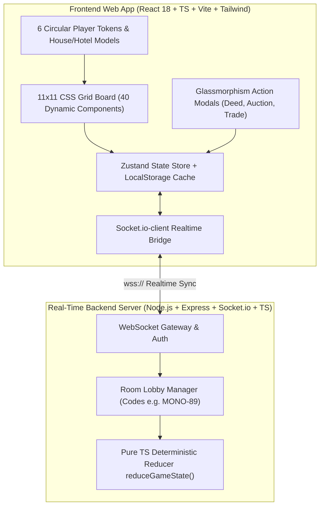

# FULL-STACK IMPLEMENTATION MASTER PLAN (VIETNAMESE DORAEMON MONOPOLY EDITION)

This document specifies the official **Full-Stack Implementation Master Plan, Layer Architecture, Component Directory Tree, and Phase Roadmap** for the Vietnamese Doraemon Monopoly Web Application ("Cờ Tỷ Phú Doraemon Bản Miền Nam"), supporting 2 to 6 players across different internet networks.

---

## 1. END-TO-END LAYERED ARCHITECTURE

---

## 2. COMPONENT TREE & MODULE BREAKDOWN

### 2.1. Client UI Hierarchy (`client/src/`)
- `components/board/MonopolyBoard.tsx`: Main 11x11 Grid container.
- `components/board/StreetSpace.tsx`: Dynamic street component with color strip and building badges.
- `components/board/CornerSpace.tsx`: Special layout for `BẮT ĐẦU`, `THĂM TÙ`, `BÃI ĐẬU XE MIỄN PHÍ`, and `VÀO TÙ`.
- `components/board/PlayerCircleToken.tsx`: 6 distinct circular player tokens (`P1` Red to `P6` Orange).
- `components/board/HouseHotelModel.tsx`: 3D green houses (1-4) or majestic red hotel (5).
- `components/center/CenterHub.tsx`: Interior 9x9 hub with Doraemon logo banner, dice tray, and feed log.
- `components/modals/TitleDeedModal.tsx`: Property inspection modal.
- `components/modals/AuctionModal.tsx`: Real-time bidding modal.

### 2.2. Core Engine & Backend (`server/src/`)
- `engine/reducer.ts`: Pure authoritative state reducer.
- `rooms/RoomManager.ts`: 6-char room code generator and session store.
- `sockets/socketHandler.ts`: WebSocket event listener and broadcaster.

---

## 3. STEP-BY-STEP EXECUTION ROADMAP
- **Phase 1:** Pure TypeScript Monopoly Engine & Vietnamese Doraemon Registry (`vietnameseBoardData.ts`).
- **Phase 2:** Responsive 11x11 Grid Board & Doraemon Southern Theme UI.
- **Phase 3:** Interactive Modals & Framer Motion Animations.
- **Phase 4:** Online Multiplayer Room Server (5-6 Players Across Internet).
- **Phase 5:** Production Deployment Guide (Vercel CDN + Render Node WebSocket Server).
