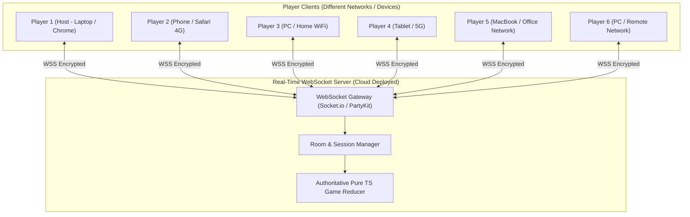
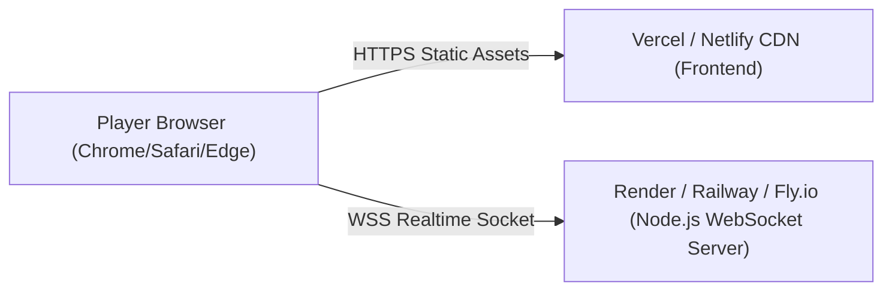

# ONLINE MULTIPLAYER ARCHITECTURE & DEPLOYMENT GUIDE (5-6 PLAYERS ACROSS DIFFERENT NETWORKS)

This document specifies the **Real-Time Online Multiplayer Architecture, WebSocket Event Schema, Room Management System, and Production Deployment Pipeline** enabling 5 to 6 players on **different devices and different internet networks** to play Monopoly seamlessly.

---

## TABLE OF CONTENTS
1. [Multiplayer Topology: Server-Authoritative Architecture](#1-multiplayer-topology-server-authoritative-architecture)
2. [Room Management & Lobby Flow (5-6 Players)](#2-room-management--lobby-flow-5-6-players)
3. [WebSocket Protocol & Event Schema](#3-websocket-protocol--event-schema)
4. [Production Deployment Guide (Free & Scalable Tier)](#4-production-deployment-guide-free--scalable-tier)
5. [Network Reconnection & State Recovery](#5-network-reconnection--state-recovery)

---

## 1. MULTIPLAYER TOPOLOGY: SERVER-AUTHORITATIVE ARCHITECTURE

To support 5-6 players across different ISP networks over the public Internet without port forwarding, the game uses a **Server-Authoritative WebSocket Topology** (Node.js + Socket.io / PartyKit):



### Why Server-Authoritative?
- **Anti-Cheat:** Clients never compute dice outcomes or money balances locally. They send an intentional action (`ROLL_DICE`, `BUY_PROPERTY`); the Server validates it against `reduceGameState`, updates the room state, and broadcasts `GAME_STATE_UPDATE` to all 6 players simultaneously.
- **NAT Traversal:** Because all players connect outbound over standard HTTPS/WSS (port 443) to a cloud WebSocket server, no firewalls or router configurations block players from joining.

---

## 2. ROOM MANAGEMENT & LOBBY FLOW (5-6 PLAYERS)

### 2.1. Room Creation & Joining Flow
1. **Host Creates Room:** Player 1 clicks "Create Online Room". The server generates a unique 6-character Room Code (e.g., `MONO-89`) and sets `maxPlayers = 8`.
2. **Share Room Code / Invitation Link:** Host shares `https://monopoly.example.com/room/MONO-89` with Players 2–6 via chat.
3. **Player Lobby Selection:** Each joining player picks their Name and Token Color/Icon.
4. **Ready Check & Start:** When 5 or 6 players are present and click "Ready", the Host clicks "Start Game". The server initializes the 40-space board and distributes `$1,500` to all players.

---

## 3. WEBSOCKET PROTOCOL & EVENT SCHEMA

### 3.1. Client-to-Server Events
```typescript
export type ClientEvent = 
  | { type: 'ROOM_CREATE'; playerName: string; token: string }
  | { type: 'ROOM_JOIN'; roomCode: string; playerName: string; token: string }
  | { type: 'GAME_START'; roomCode: string }
  | { type: 'GAME_ACTION'; roomCode: string; action: GameAction };
```

### 3.2. Server-to-Client Broadcast Events
```typescript
export type ServerEvent = 
  | { type: 'ROOM_STATE_SYNC'; room: RoomLobbyState }
  | { type: 'GAME_STATE_UPDATE'; state: GameState; lastAction: GameAction; timestamp: number }
  | { type: 'PLAYER_DISCONNECTED'; playerId: string; reconnectTimeoutMs: number }
  | { type: 'ERROR_NOTIFICATION'; message: string };
```

---

## 4. PRODUCTION DEPLOYMENT GUIDE (FREE & SCALABLE TIER)

To deploy for 5–6 players across different networks with zero server maintenance costs, we recommend the **Vite Frontend + Node WebSocket Backend** split architecture:



### 4.1. Frontend Deployment (Static SPA on Vercel / Netlify)
1. Build the React Vite frontend: `npm run build`.
2. Configure environment variable `VITE_WS_SERVER_URL=wss://monopoly-server.onrender.com`.
3. Deploy the `/dist` output directory to **Vercel** or **Netlify** CDN.

### 4.2. Backend Deployment (Real-Time Server on Render / Railway / Fly.io)
1. Server entry point: `server/index.ts` running Express + `socket.io` server.
2. Configure CORS to allow origin from your Vercel/Netlify domain.
3. Deploy to **Render.com Web Service (Node)** or **Railway.app**. Both provide automatic SSL (`wss://`) and persistent real-time WebSocket connection handling suitable for 5-8 simultaneous players per room.

---

## 5. NETWORK RECONNECTION & STATE RECOVERY

In a 5-6 player game lasting 45–90 minutes, temporary WiFi/4G drops are common. The architecture enforces graceful reconnection:
- **Session Tokens:** When a player joins a room, the server issues a JWT/UUID `sessionToken` stored in `sessionStorage`.
- **60-Second Grace Period:** If Player 4's network drops, the server pauses Player 4's turn timer and broadcasts a `"Player 4 Reconnecting..."` badge to the other 5 players.
- **Seamless Rejoin:** When Player 4 refreshes or reconnects with their `sessionToken`, the server immediately sends the latest authoritative `GAME_STATE_UPDATE`.
