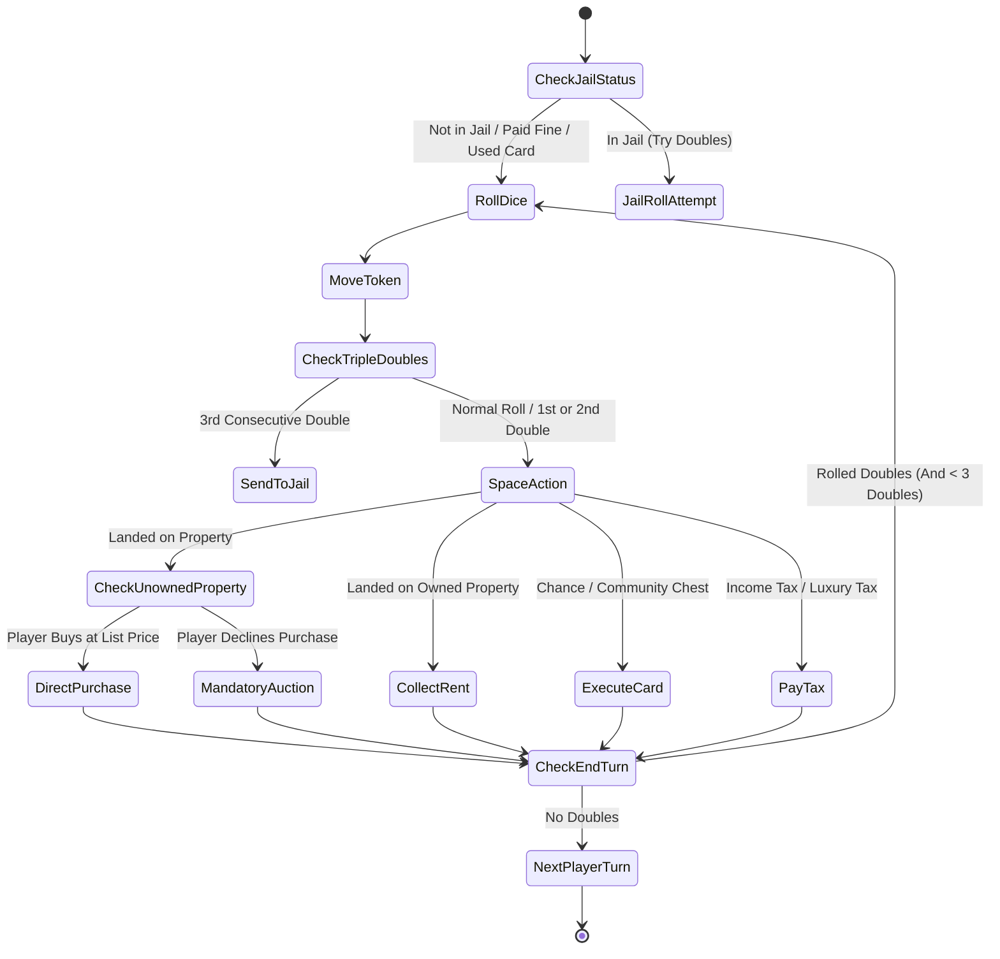

# MONOPOLY GAME SPECIFICATIONS & DEVELOPER RULEBOOK

> **IMPORTANT NOTICE:** This directory serves as the **Single Source of Truth** for the Monopoly board game project. All developers, UI/UX designers, AI agents, and QA testers **must read these specifications before implementing or modifying any game logic or board features**.

---

## 1. DIRECTORY STRUCTURE & RULE FILES

The `Rule/` folder contains official specifications, technical architecture, and rulebooks for the Monopoly gameboard:

- **[README.md](file:///c:/Users/admin/MyProject/Monopoly/Rule/README.md)** *(This Document)*: Technical specification overview, board index map, game constants, state machine, and core implementation checklists.
- **[OFFICIAL_RULES.md](file:///c:/Users/admin/MyProject/Monopoly/Rule/OFFICIAL_RULES.md)**: Complete official gameplay rulebook (Hasbro Classic Monopoly Standard) for gameplay verification and player reference.
- **[TECHNICAL_SPEC.md](file:///c:/Users/admin/MyProject/Monopoly/Rule/TECHNICAL_SPEC.md)**: Comprehensive Web-based Monopoly technical architecture, 11x11 CSS Grid layout specs, TypeScript data models (`Player`, `BoardSpace`, `GameState`), and UI/UX animation rules.
- **[ARCHITECTURE_WORKFLOW.md](file:///c:/Users/admin/MyProject/Monopoly/Rule/ARCHITECTURE_WORKFLOW.md)**: End-to-end layered architecture, modern tech stack (React 18, Vite, TypeScript, Tailwind, Framer Motion), component tree, and sequence diagram workflows.
- **[ONLINE_MULTIPLAYER_DEPLOYMENT.md](file:///c:/Users/admin/MyProject/Monopoly/Rule/ONLINE_MULTIPLAYER_DEPLOYMENT.md)**: Real-time multiplayer architecture for 5-6 players across different devices/networks over Internet, WebSocket protocol, room lobby management, and production cloud deployment guide.
- **[VIETNAMESE_BOARD_EDITION.md](file:///c:/Users/admin/MyProject/Monopoly/Rule/VIETNAMESE_BOARD_EDITION.md)**: Vietnamese Client Localization & 40-Space Board Registry modeled after the classic Vietnamese "Cờ Tỷ Phú" edition.
- **[IMPLEMENTATION_MASTER_PLAN.md](file:///c:/Users/admin/MyProject/Monopoly/Rule/IMPLEMENTATION_MASTER_PLAN.md)**: End-to-end full-stack master implementation plan, layered architecture, component tree, and step-by-step roadmap.

---

## 2. CORE GAME CONSTANTS & BALANCING PARAMETERS

All code implementations involving currency, limits, or board rules must conform to the following constants:

| Constant / Property Name | Standard Value | Description |
| :--- | :---: | :--- |
| `BOARD_SIZE` | `40` | Total number of spaces on the board (Index `0` to `39`). |
| `STARTING_MONEY` | `$1,500` | Starting cash distributed to each player at initialization. |
| `GO_SALARY` | `$200` | Cash collected when passing or landing on `GO` (Index 0). |
| `JAIL_FINE` | `$50` | Bail fine to immediately exit Jail at the start of a turn. |
| `INCOME_TAX_AMOUNT` | `$200` | Tax paid when landing on Income Tax (Index 4). |
| `LUXURY_TAX_AMOUNT` | `$100` | Tax paid when landing on Luxury Tax (Index 38). |
| `MAX_HOUSES_PER_PROPERTY` | `4` | Maximum Houses allowed on a property before upgrading to a Hotel. |
| `MAX_HOTELS_PER_PROPERTY` | `1` | Maximum Hotels allowed per property (converted from 4 Houses). |
| `TOTAL_BANK_HOUSES` | `32` | Strict physical House limit held by the Bank. |
| `TOTAL_BANK_HOTELS` | `12` | Strict physical Hotel limit held by the Bank. |
| `MORTGAGE_INTEREST_RATE` | `10%` | Interest rate paid when unmortgaging (`UnmortgageCost = MortgageValue * 1.1`). |

---

## 3. 40-SPACE BOARD INDEX MAP

The board is indexed `0` through `39` clockwise, starting at the `GO` corner space:

```
       20  21  22  23  24  25  26  27  28  29  30 (Go to Jail)
     +---+---+---+---+---+---+---+---+---+---+---+
  19 |   |                                   |   | 31
  18 |   |                                   |   | 32
  17 |   |          MONOPOLY BOARD           |   | 33
  16 |   |             (40 SPACES)           |   | 34
  15 |   |                                   |   | 35
  14 |   |                                   |   | 36
  13 |   |                                   |   | 37
  12 |   |                                   |   | 38 (Luxury Tax)
  11 |   |                                   |   | 39
     +---+---+---+---+---+---+---+---+---+---+---+
       10   9   8   7   6   5   4   3   2   1   0 (GO)
    (Jail)
```

### Fixed Special Space Indexes:
- **`0`**: `GO` (Collect $200)
- **`4`**: `Income Tax` (Pay $200)
- **`10`**: `Jail / Just Visiting`
- **`20`**: `Free Parking` (Safe resting space; no monetary transaction)
- **`30`**: `Go to Jail` (Immediate transition to Index 10; no GO salary)
- **`38`**: `Luxury Tax` (Pay $100)
- **Railroads (4 Spaces):** `5` (Reading), `15` (Pennsylvania), `25` (B&O), `35` (Short Line)
- **Utilities (2 Spaces):** `12` (Electric Company), `28` (Water Works)
- **Chance Spaces (3 Spaces):** `7`, `22`, `36`
- **Community Chest Spaces (3 Spaces):** `2`, `17`, `33`

---

## 4. TURN STATE MACHINE & LOGIC PIPELINE

When executing a player's turn lifecycle, implementers must follow this pipeline:



### Key Logic Checklist for Developers:
1. **Mandatory Auction Enforcement:** If a player lands on an unowned property and declines to buy it at list price, the game **must trigger an open auction** among all players (including the player who declined).
2. **Double Rent on Unimproved Color Groups:** When checking rent for an unimproved street property, verify if the owner possesses `100%` of that color group and none are mortgaged. If true, multiply base rent by `2`.
3. **Even Build Rule Enforcement:** Do not allow building Houses on a property if it would result in more than a `1-House difference` compared to other properties in the same color group.
4. **Active Rights in Jail:** Players In Jail remain fully eligible to receive rent, trade, build, mortgage, and participate in auctions.
