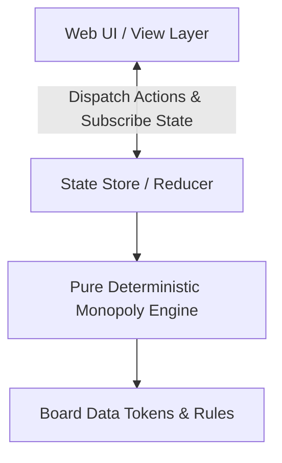
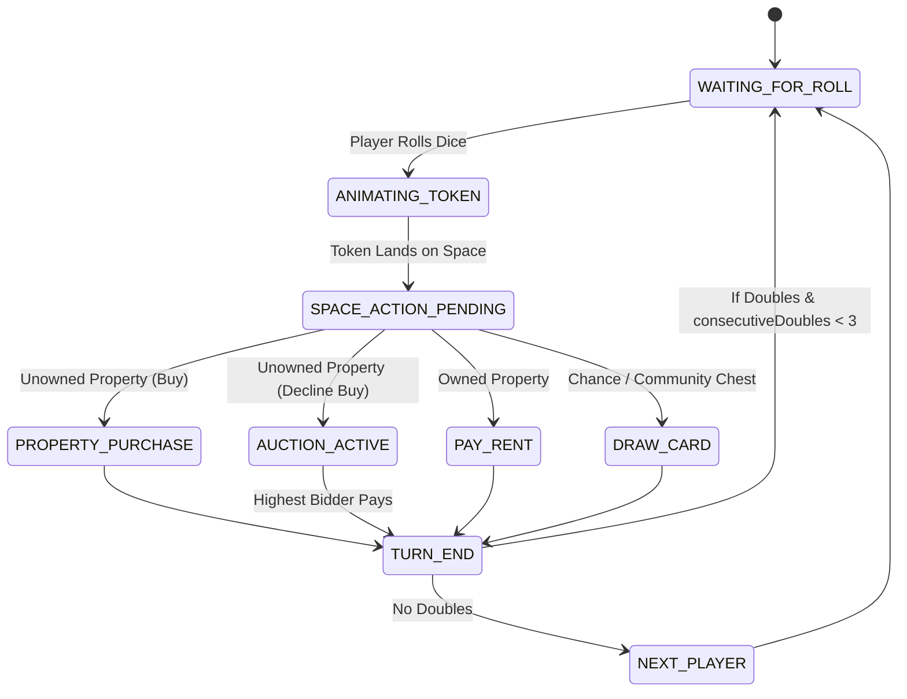

# MONOPOLY WEB APPLICATION - TECHNICAL ARCHITECTURE & SPECIFICATION

This document outlines the **Technical Architecture and Engineering Specifications** for building a rich, interactive, and deterministic **Web-based Monopoly Game** ("Web Chơi Monopoly").

---

## TABLE OF CONTENTS
1. [System Architecture & Core Principles](#1-system-architecture--core-principles)
2. [UI Board Layout: 11x11 Grid System](#2-ui-board-layout-11x11-grid-system)
3. [Core TypeScript Data Models](#3-core-typescript-data-models)
4. [Game Engine State Machine](#4-game-engine-state-machine)
5. [Animation & Visual Rendering Specs](#5-animation--visual-rendering-specs)
6. [Multiplayer & Persistence Strategy](#6-multiplayer--persistence-strategy)

---

## 1. SYSTEM ARCHITECTURE & CORE PRINCIPLES

### 1.1. Recommended Tech Stack
- **Frontend Framework:** React 18+ with TypeScript (Vite).
- **Styling & Layout:** Modern CSS Grid / Tailwind CSS with custom Design Tokens (rich colors, glassmorphism UI overlays, crisp typography).
- **Animation Layer:** Framer Motion or GSAP for smooth token pathing around the board and 3D dice physics.
- **Sound & Audio:** Web Audio API for immersive spatial UI feedback (dice clatter, cash register, jail bars closing).

### 1.2. Architectural Pattern: Pure Deterministic Engine vs. UI Layer

- **Strict Separation:** The Game Engine must be completely decoupled from DOM manipulation. Given an input state $S_n$ and an Action $A_n$, the Engine deterministically produces state $S_{n+1}$.

---

## 2. UI BOARD LAYOUT: 11x11 GRID SYSTEM

A classic Monopoly board has 10 spaces per side (11 grid units across including corners). To render a responsive, perfectly aligned Web Board, use a CSS Grid of **11 rows x 11 columns**:

```css
.monopoly-board {
  display: grid;
  grid-template-columns: repeat(11, 1fr);
  grid-template-rows: repeat(11, 1fr);
  aspect-ratio: 1 / 1;
}
```

### 2.1. Space Positioning Mapping
- **Bottom Row (Row 11):**
  - `GO` (Index 0): Grid Column `11`, Grid Row `11`
  - Spaces `1` to `9`: Grid Columns `10` down to `2`, Grid Row `11`
  - `Jail / Just Visiting` (Index 10): Grid Column `1`, Grid Row `11`
- **Left Column (Column 1):**
  - Spaces `11` to `19`: Grid Column `1`, Grid Rows `10` down to `2`
  - `Free Parking` (Index 20): Grid Column `1`, Grid Row `1`
- **Top Row (Row 1):**
  - Spaces `21` to `29`: Grid Columns `2` to `10`, Grid Row `1`
  - `Go to Jail` (Index 30): Grid Column `11`, Grid Row `1`
- **Right Column (Column 11):**
  - Spaces `31` to `39`: Grid Column `11`, Grid Rows `2` to `10`

### 2.2. Board Center Area (Rows 2-10, Columns 2-10)
The interior 9x9 grid area houses:
- **Interactive Dice Tray & Roll Button**
- **Community Chest & Chance Card Decks**
- **Live Game Feed / Action Log**
- **Modal Overlays:** Auctions, Property Trade Hub, Mortgage Manager.

### 2.3. Rendering Strategy: HTML/CSS Grid vs. Static SVG Background
- **Mandatory Approach: HTML5 + CSS Grid Component Rendering (100% Dynamic)**
  - Do **not** use a static SVG or PNG image as the background for the 40 board spaces.
  - Render each of the 40 spaces as an independent React Component (`<StreetSpace />`, `<CornerSpace />`).
  - **Dynamic State Visualization:** Allows real-time border coloring when owned, rendering dynamic House/Hotel badges (`<HouseBadge count={3} />`), visual dimming when mortgaged, and instant interactive click-to-inspect Title Deed overlays.
- **Where SVG Should Be Used:**
  - Use modular SVG icons **only inside** the individual spaces for iconography (Railroad locomotive, Electric bulb, Water tap, Jail bars, Corner illustrations, and Player Tokens).

### 2.4. Player Tokens & Building Models
- **6 Circular Player Tokens (`PlayerCircleToken.tsx`):**
  - Players 1 to 6 are represented by glossy, 3D-styled circular tokens with distinct glowing color palettes: Red (`#EF4444`), Blue (`#3B82F6`), Yellow/Gold (`#EAB308`), Emerald Green (`#10B981`), Purple (`#A855F7`), and Orange (`#F97316`).
  - When multiple players occupy the same space, tokens are clustered using `TokenCluster.tsx` to prevent overlapping.
- **House & Hotel Building Models (`HouseHotelModel.tsx`):**
  - **Houses (1-4):** Rendered as mini 3D green gabled structures (`bg-emerald-600`) lined horizontally along the property color strip.
  - **Hotel (5):** Rendered as a single prominent red building (`bg-rose-600`) with a gold star crest.

---

## 3. CORE TYPESCRIPT DATA MODELS

```typescript
export type PropertyColorGroup = 
  | 'BROWN' | 'LIGHT_BLUE' | 'PINK' | 'ORANGE' 
  | 'RED' | 'YELLOW' | 'GREEN' | 'DARK_BLUE';

export interface Player {
  id: string;
  name: string;
  color: string;           // Hex color for UI representation
  token: string;           // Token SVG/Icon identifier
  balance: number;         // Starting balance: 1500
  position: number;        // Board space index (0 - 39)
  inJail: boolean;
  jailTurnsCounter: number;// Max 3 failed double attempts
  getOutOfJailCards: number;
  isBankrupt: boolean;
}

export type SpaceType = 
  | 'PROPERTY' | 'RAILROAD' | 'UTILITY' 
  | 'CHANCE' | 'COMMUNITY_CHEST' 
  | 'TAX' | 'CORNER';

export interface BoardSpace {
  index: number;           // 0 to 39
  name: string;
  type: SpaceType;
  price?: number;
  colorGroup?: PropertyColorGroup;
  ownerId?: string | null;
  houses: number;          // 0 to 4; 5 represents 1 Hotel
  isMortgaged: boolean;
  rentTiers?: number[];    // [Base, 1House, 2House, 3House, 4House, Hotel]
}

export type TurnPhase = 
  | 'WAITING_FOR_ROLL'
  | 'ANIMATING_TOKEN'
  | 'SPACE_ACTION_PENDING' // e.g., Buy vs Auction decision
  | 'AUCTION_ACTIVE'
  | 'TRADE_ACTIVE'
  | 'TURN_END';

export interface GameState {
  players: Player[];
  spaces: BoardSpace[];
  activePlayerIndex: number;
  currentTurnPhase: TurnPhase;
  diceResult: [number, number];
  consecutiveDoubles: number;
  bankRemainingHouses: number; // Max 32
  bankRemainingHotels: number; // Max 12
}
```

---

## 4. GAME ENGINE STATE MACHINE



---

## 5. ANIMATION & VISUAL RENDERING SPECS

### 5.1. Token Movement Interpolation
- Tokens must **not** teleport instantly across the board.
- When moving from Index `A` to Index `B`, calculate the sequence of perimeter index steps: $[A+1, A+2, \dots, B]$.
- Apply a duration of `150ms per space step` with easing so the player visually tracks where their token travels.

### 5.2. Rich Visual Aesthetics Requirements
- **Property Cards Overlay:** Clicking any space displays a crisp, high-resolution digital Title Deed modal showing rent tiers, mortgage value, and house costs.
- **Glassmorphism Action Hub:** Use frosted glass modals (`backdrop-blur-md bg-slate-900/80`) for Trades and Auctions so the board remains partially visible underneath.

---

## 6. MULTIPLAYER & PERSISTENCE STRATEGY

### 6.1. Local Pass-and-Play / vs AI
- Save state to `localStorage` after every deterministic action (`monopoly_save_v1`).

### 6.2. WebSockets / Online Multiplayer Support
- Use a Server-Authoritative architecture via WebSockets (e.g., Socket.io or WebRTC data channels).
- Clients send `ActionRequests` (`{ type: 'ROLL_DICE', playerId: 'p1' }`); the Server validates and broadcasts `StateUpdated` events.
